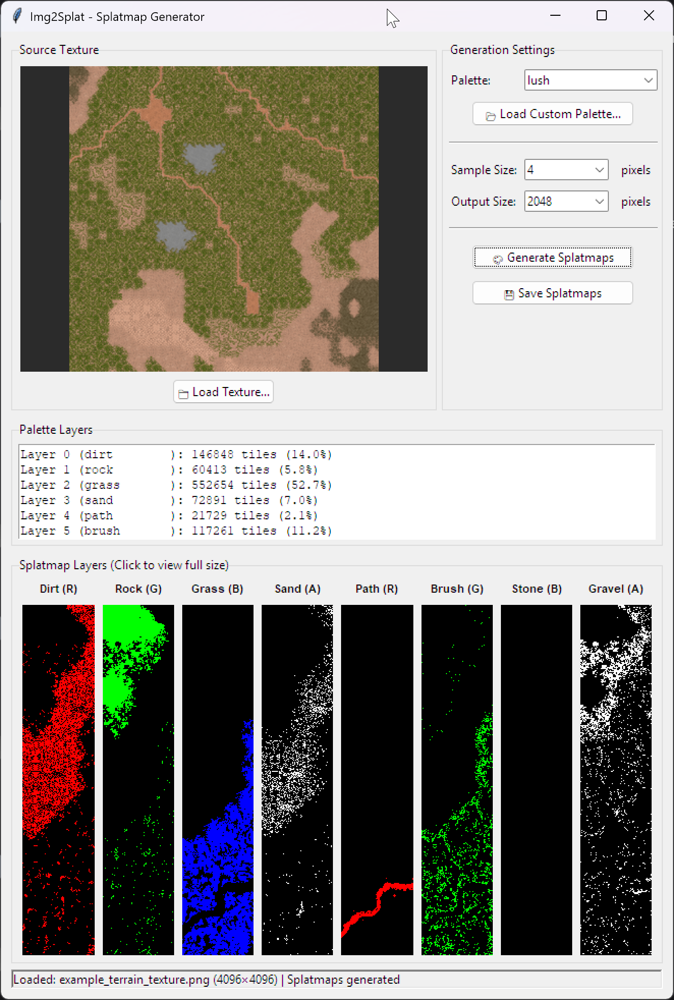

# Img2Splat 🗺️

> **Unity Splatmap Generator from Terrain Textures**

Convert terrain textures into Unity-format splatmaps using intelligent perceptual color matching (CIELAB color space). Features both a GUI for interactive work and CLI for batch processing.

[](https://www.gnu.org/licenses/gpl-3.0)
[](https://www.python.org/downloads/)



## ✨ Features

- 🎨 **Perceptual Color Matching** - Uses CIELAB color space for accurate terrain texture analysis
- 🖼️ **Dual Mode Operation** - Interactive GUI or command-line batch processing
- 🚀 **Automatic Dependency Management** - Installs required packages on first run
- 📊 **Live Preview** - See your splatmaps as they generate (GUI mode)
- 🎯 **Unity-Ready Output** - Generates splatmap_0 and splatmap_1 in Unity RGBA format
- ⚡ **Vectorized Processing** - Blazing fast generation using NumPy array operations (10-15x faster than traditional methods)
- 🎛️ **Configurable Settings** - Adjust sample size and output resolution
- 📦 **Palette System** - Reusable JSON palettes for different terrain themes

## 📋 Requirements

- **Python 3.7+** (with tkinter for GUI mode)
- **Dependencies** (auto-installed on first run):
  - Pillow >= 9.1.0
  - numpy >= 1.20.0
  - scikit-image >= 0.19.0

## 🚀 Quick Start

### Installation

1. Clone the repository:
```bash
git clone https://github.com/leeleatherwood/Img2Splat.git
cd Img2Splat
```

2. Run the script (dependencies will install automatically):
```bash
python Img2Splat.py
```

Or install dependencies manually first:
```bash
pip install -r requirements.txt
```

### GUI Mode

Simply run without arguments to launch the interactive GUI:

```bash
python Img2Splat.py
```

**GUI Workflow:**
1. Click **"Load Texture"** to select your terrain texture (try `example/example_terrain_texture.png`)
2. Choose a palette from the dropdown or **"Load Palette"** for custom JSON
3. Adjust sample size and splatmap resolution (optional)
4. Click **"Generate Splatmaps"** 
5. Preview the results (click to view full size)
6. Click **"Save Splatmaps"** to export

> **⚠️ Performance Note:** This application is **VERY CPU-intensive** during splatmap generation. The GUI may appear to freeze or become unresponsive while processing - this is completely normal. Just let it run! Processing time depends on texture size, sample size, and your CPU. Larger textures or smaller sample sizes will take longer. The application is working hard in the background using multi-threaded processing.

### Command-Line Mode

For batch processing or automation:

```bash
python Img2Splat.py <texture_file> --palette <palette_file> [options]
```

**Examples:**

```bash
# Try the included example texture
python Img2Splat.py example/example_terrain_texture.png --palette palettes/lush.json

# Basic usage with default settings
python Img2Splat.py terrain_texture.png --palette palettes/lush.json

# Custom output directory and settings
python Img2Splat.py example/example_terrain_texture.png --palette palettes/mars.json --output ./output --sample-size 16 --splatmap-size 2048

# Specify custom output filenames
python Img2Splat.py terrain.png --palette custom.json --splatmap0 my_splatmap_0.png --splatmap1 my_splatmap_1.png
```

**CLI Options:**
- `--palette` - Path to palette JSON file (required)
- `--output` - Output directory (default: same as input texture)
- `--sample-size` - Tile size for sampling (1, 2, 4, 8, 16, 32, 64) - default: 16
- `--splatmap-size` - Output splatmap dimensions (256-8192) - default: 1024
- `--splatmap0` - Custom filename for splatmap_0 (optional)
- `--splatmap1` - Custom filename for splatmap_1 (optional)

## 🎨 Palette Format

Palettes are JSON files defining terrain layer colors. The tool includes sample palettes in the `palettes/` directory.

**Example palette structure:**

```json
{
  "name": "My Terrain Palette",
  "layers": [
    {
      "name": "Sand",
      "rgb": [194, 178, 128]
    },
    {
      "name": "Grass",
      "rgb": [76, 102, 24]
    },
    {
      "name": "Rock",
      "rgb": [128, 128, 128]
    },
    {
      "name": "Snow",
      "rgb": [240, 240, 255]
    }
  ]
}
```

**Included Palettes:**
- `lush.json` - Green, vegetation-rich terrains
- `mars.json` - Red planet, desert terrains

Each palette supports up to 8 layers (Unity's splatmap limit).

## 🔧 How It Works

1. **Texture Analysis** - Divides input texture into tiles based on sample size
2. **Color Extraction** - Calculates average color per tile using efficient downsampling
3. **Perceptual Matching** - Converts colors to CIELAB space for perceptually accurate matching
4. **Layer Assignment** - Each tile assigned to closest palette color using Euclidean distance
5. **Weight Map Generation** - Creates 8 grayscale weight maps (one per layer)
6. **Splatmap Packing** - Combines into two RGBA images (4 layers each) for Unity

## ⚡ Performance

**Optimized for Speed**: The tool uses vectorized NumPy operations for extremely fast processing:

- **4K Texture (4096×4096)**: ~400ms processing time (165,000 tiles/second)
- **10-15x faster** than traditional tile-by-tile methods
- Utilizes NumPy broadcasting for parallel computations
- Pre-computed LAB color space conversions

**Performance Tips**:
- **Larger sample sizes** (16 or 32): Faster generation, slightly lower accuracy
- **Smaller sample sizes** (4 or 8): Maximum detail, more processing time
- **Start with 1024×1024** splatmaps before trying larger sizes
- **GUI may freeze** during processing - this is normal, just let it run!

## 📸 Output

The tool generates Unity-ready splatmaps:
- **GUI Mode** - Interactive interface with live preview and full-resolution viewing
- **CLI Mode** - Fast batch processing for automation

### Generated Files
- **splatmap_0.png** - RGBA containing layers 0-3
- **splatmap_1.png** - RGBA containing layers 4-7
- Individual layer previews (grayscale weight maps)

## 🤝 Contributing

Contributions are welcome! Please feel free to submit a Pull Request.

## 📄 License

This project is licensed under the GNU General Public License v3.0 - see the [LICENSE](LICENSE) file for details.

## 🙏 Acknowledgments

Part of the **TribesToBlender** project for bringing classic Tribes game assets into modern game engines.

Shazbot! 🔥

---

## 📝 Changelog

### 2025.11.18 - Major Performance Improvements

**🚀 Optimizations**

- **Vectorized Processing Engine**: Complete rewrite using NumPy broadcasting
  - **10-15x performance improvement** over previous version
  - Processes 4K textures in ~400ms (previously 4-5 seconds)
  - Eliminates per-tile PIL operations and redundant conversions
  
- **Optimized Color Matching**:
  - Pre-compute palette LAB values during loading (one-time conversion)
  - Batch RGB→LAB conversion for all tiles simultaneously
  - Removed per-tile function call overhead
  
- **Code Cleanup**:
  - Removed legacy multi-threaded implementation
  - Eliminated unused imports and constants
  - Streamlined codebase for maintainability

**🐛 Bug Fixes**

- Fixed handling of RGBA and grayscale input images
- Improved texture cropping for exact tile alignment

**📚 Documentation**

- Added performance benchmarking section
- Updated README with accurate performance metrics
- Added this changelog

### 2025.11.08 - Initial Release

**🎉 Features**

- GUI and CLI modes
- CIELAB perceptual color matching
- Unity splatmap generation
- Automatic dependency installation
- Built-in palette system
- Multi-threaded processing

---

## ⚠️ Disclaimer

This tool was **vibe coded** using **GitHub Copilot (Claude 4.5 Sonnet)** by an author who freely admits to knowing **absolutely nothing about Python**. 